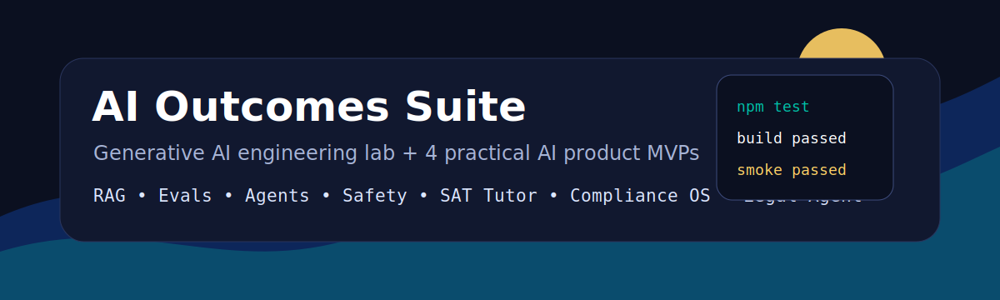

<div align="center">



# AI Outcomes Suite

### Generative AI engineering lab plus four practical AI product MVPs.

[](https://github.com/P-r-e-m-i-u-m/ai-outcomes-suite/actions/workflows/ci.yml)
[](LICENSE)
[](package.json)
[](tsconfig.json)
[](curriculum/README.md)

Build AI the way real products need it: retrieval, evals, safety, agents, documentation, CI, and user outcomes.

[Quick Start](#quick-start) . [GenAI Lab](#generative-ai-engineering-lab) . [Products](#product-mvps) . [Curriculum](curriculum/README.md) . [Good First Issues](docs/good-first-issues.md)

</div>

## What This Repo Builds

| Product | Wedge | What Works Today |
| --- | --- | --- |
| Generative AI Engineering Lab | Builders learning and shipping GenAI systems | RAG, prompt evals, safety scanner, agent planner, curriculum, reusable prompts |
| SAT Math Outcome Tutor | Students who need measurable score improvement | Skill tracking, mastery scoring, weakest-skill detection, seven-day plan |
| AI Compliance OS | SaaS teams shipping AI features | Prompt/response logging, consent records, risk levels, human review queue, audit report |
| Personal Legal Agent | Renters, employees, insurance/refund disputes | Document type detection, risk flags, deadline extraction, action letter drafting |

## Quick Start

```bash
npm install
npm run build
npm run demo:all
```

Run one product at a time:

```bash
npm run demo:tutor
npm run demo:compliance
npm run demo:legal
npm run demo:genai
```

## Demo Preview

```text
=== Generative AI Engineering Lab ===
RAG answer with citations
prompt eval passed
safety scan completed
agent plan generated

=== SAT Tutor Outcome Plan ===
readinessScore: 44
weakestSkills: systems, probability, geometry
nextSevenDays: targeted practice plan

=== AI Compliance OS Report ===
totalEvents: 2
highRiskEvents: 1
humanOversightQueue: 1

=== Personal Legal Agent Analysis ===
documentType: rental
risks: refund restriction, termination clause, deposit deduction risk
deadline: within 30 days
```

## Generative AI Engineering Lab

This is the new core of the repo. The GenAI Lab teaches and implements the patterns behind real AI products:

- **RAG**: retrieve local knowledge before answering.
- **Evals**: check expected and forbidden behavior.
- **Safety**: scan for legal, financial, medical, PII, and self-harm risk.
- **Agents**: turn goals into reviewable tool-using plans.
- **Artifacts**: prompts, datasets, eval files, curriculum, and reusable outputs.

Core files:

- `packages/genai-lab/src/index.ts`
- `curriculum/README.md`
- `prompts/`
- `evals/`
- `outputs/`
- `docs/genai-lab-prd.md`

## Product MVPs

The repo is not only a course and not only a demo. Each GenAI pattern connects to a product:

- RAG powers grounded tutor explanations, compliance reports, and legal document summaries.
- Evals make AI behavior testable.
- Safety scanning creates trust boundaries.
- Agent plans show how products can route risky work to human review.

## Why This Can Become Big

Most AI demos are wrappers. These three products aim at painful, repeated, expensive workflows:

- Parents pay for outcomes, not content libraries.
- AI companies need compliance evidence before customers trust them.
- Normal people need help understanding documents before they lose money.
- Builders need a practical path from GenAI fundamentals to shipped tools.

The repo is built so contributors can pick one lane and make it deeper.

## Repository Structure

```text
apps/cli/                  Runnable demos for all three MVPs
curriculum/                GenAI learning path from foundations to productization
datasets/                  Small local knowledge datasets
evals/                     Prompt and behavior evaluation cases
outputs/                   Reusable prompts, agents, RAG notes, eval summaries
packages/shared/           Shared types and mock AI provider
packages/genai-lab/        RAG, prompt evals, safety scanner, agent planner
packages/sat-tutor/        Skill gap tracking and study plan generator
packages/compliance-os/    Compliance event SDK and report generator
packages/legal-agent/      Legal document scanner and action letter generator
docs/                      PRDs, architecture, roadmap, launch plan
examples/                  Example inputs
```

## Product Details

### SAT Math Outcome Tutor

Tracks question attempts by skill and produces a study plan based on accuracy, difficulty, and pace.

Core files:

- `packages/sat-tutor/src/index.ts`
- `docs/sat-tutor-prd.md`

### AI Compliance OS

Small SDK-style logger for AI products. It records model usage, prompts, responses, consent, safety checks, risk level, and human oversight status.

Core files:

- `packages/compliance-os/src/index.ts`
- `docs/compliance-os-prd.md`

### Personal Legal Agent

Plain-language document analyzer for rental, employment, and insurance-like documents. It flags risks, finds deadlines, and drafts an action letter.

Core files:

- `packages/legal-agent/src/index.ts`
- `docs/legal-agent-prd.md`

## Star-Friendly Roadmap

- GenAI curriculum expanded into 30 small lessons.
- Web dashboard for the GenAI Lab and product demos.
- Web dashboard for all three products.
- OpenAI/provider adapter with mock mode.
- PDF/DOCX upload for legal documents.
- CSV/PDF compliance exports.
- SAT question bank format and importer.
- Real test suite with fixtures.
- Hosted demo.
 - MCP/server examples for agent workflows.

See `docs/roadmap.md` for the longer plan.

## Contributing

Contributions are welcome. The best first PRs are:

- Add one GenAI lesson with a runnable artifact.
- Add prompt eval cases.
- Add RAG datasets and citation examples.
- Add SAT skills and sample questions.
- Add compliance export formats.
- Add legal risk patterns with jurisdiction notes.
- Improve examples and docs.
- Add tests around the current engines.

Read `CONTRIBUTING.md` and `docs/good-first-issues.md`.

## Important Legal Notice

The legal-agent package is for information and drafting support only. It does not provide legal advice, does not create an attorney-client relationship, and should not be used as a substitute for a qualified lawyer.

## License

MIT. Build with it, fork it, improve it.
